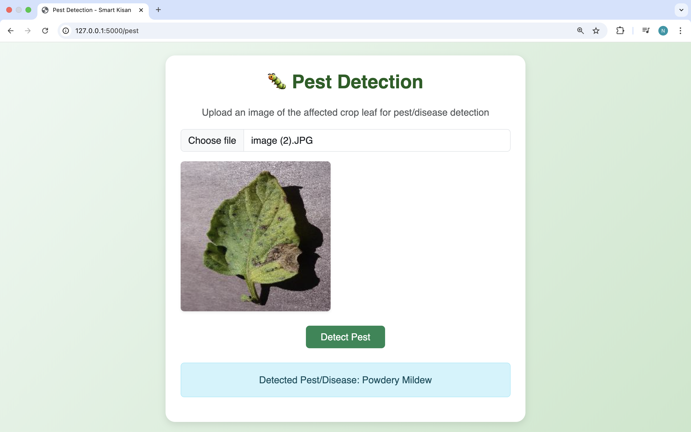

# 🌱 Smart Kisan – AI-Powered Assistant for Farmers  

Smart Kisan is a web-based platform designed to empower farmers with **AI-driven recommendations, real-time weather updates, pest detection, and market price tracking** — all accessible through a **multilingual chatbot**.  

---

## 🔑 Features  

### 🤖 Multilingual AI Chatbot  
- Farmers can ask questions in **any language (text/voice)**.  
- Powered by **Groq API (LLaMA model)** for instant and reliable answers.  

### 🌾 Crop & Fertilizer Recommendation  
- Provides suitable **crop and fertilizer suggestions** based on soil parameters:  
  - N, P, K values  
  - pH level  
  - Rainfall  
  - Humidity  
  - Soil type  

### ⛅ Weather Forecast  
- Farmers can get **real-time weather updates** using their **pincode**.  
- Helps in planning sowing, irrigation, and harvesting.  

### 🐛 Pest Detection  
- Farmers can **upload crop images**.  
- The model detects **pests/diseases** and provides possible treatments.  

### 💹 Market Price Tracking  
- Tracks **real-time mandi prices** for different crops.  
- Enables farmers to make better selling decisions.  

---
## Demo

Here’s how the app looks:
  




---

## 💡 Innovation & Impact  
- **One-stop digital solution** for farmers.  
- **Multilingual support** ensures accessibility across India.  
- **Affordable and scalable**, making it suitable for rural adoption.  

---

## 🛠 Tech Stack  
- **Frontend:** HTML, CSS, JavaScript, Bootstrap  
- **Backend:** Flask (Python)  
- **AI/ML Models:**  
  - Groq API (LLaMA model) – Multilingual Q&A  
  - Random Forest & other ML models – Crop & Fertilizer Recommendation  
  - CNN – Pest Detection  
- **APIs:**  
  - Weather API (Free) 
---

## 🚀 Getting Started  

### 1️⃣ Clone the repository
```bash
# Clone repo
git clone https://github.com/Nishant840/Smart-Kisan.git
cd Smart-Kisan

# Install dependencies
pip install -r requirements.txt

# 🔑 Environment Setup
Before running the app, set your **Groq API key** as an environment variable:

### On Linux / macOS:
export GROQ_API_KEY=your_api_key_here

### On Windows:
setx GROQ_API_KEY "your_api_key_here"
# Run app
python app.py
```
## License
MIT License.

## 🙏 Acknowledgements

- **Groq API (LLaMA model)** — for powering the multilingual Q&A chatbot  
- **WeatherMap / weather API** — for fetching live weather data  
- **Crop Recommendation Dataset (Kaggle)** — used for training crop/soil recommendation models — [Crop Recommendation Dataset](https://www.kaggle.com/datasets/atharvaingle/crop-recommendation-dataset) :contentReference[oaicite:0]{index=0}  
- **Crop & Soil Dataset (Kaggle)** — used as a composite dataset relating soil parameters to crop choices — [Crop and Soil Dataset](https://www.kaggle.com/datasets/shankarpriya2913/crop-and-soil-dataset) :contentReference[oaicite:1]{index=1}  
- **Agricultural Pests / Disease Dataset (Kaggle)** — used for pest detection / classification model training — [Crop Pest and Disease Detection](https://www.kaggle.com/datasets/nirmalsankalana/crop-pest-and-disease-detection) :contentReference[oaicite:2]{index=2}  
- **Indian Crop Price / Market Datasets** — for fetching historical & real-time market rates (you can link the specific source you used)  
- **Open-source libraries**: scikit-learn, pandas, numpy, Flask, Pillow, OpenCV, etc.  
- **Community & Contributors**: Thanks to the makers of the datasets, API providers, and the open source community for tools and inspiration  

## Author

Nishant Kumar  
IIIT Bhopal • SDE/ML Enthusiast  
https://github.com/Nishant840
